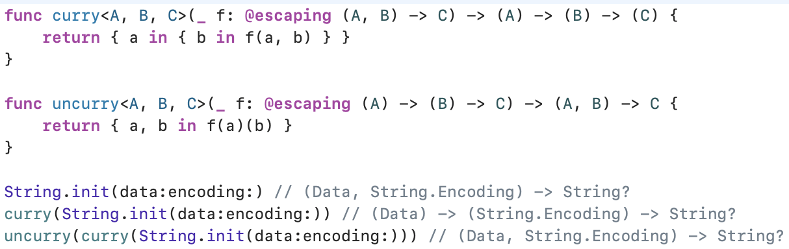
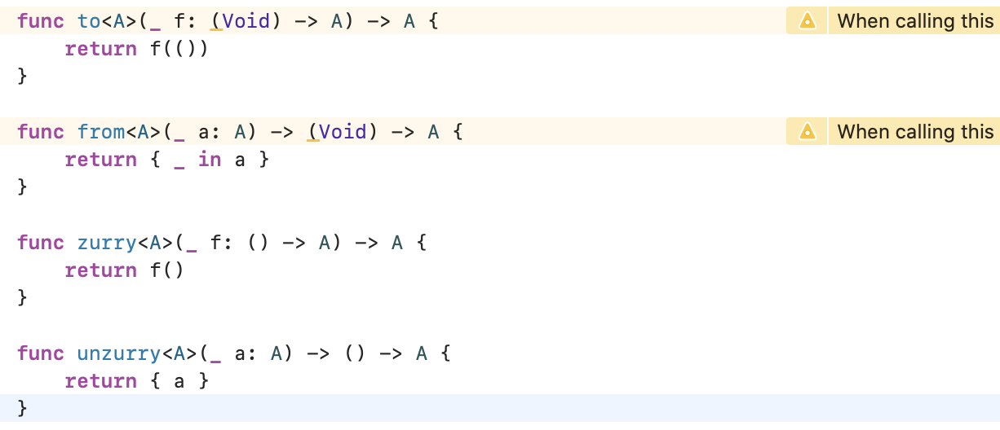

<!--
_class: lead
_footer: iOSアプリ開発のためのFunctional Architecture情報共有会
_paginate: false
-->
# Swift の関数と代数学（指数）
## part2 (#9 Algebraic Data Types: Exponents)

---
## 今回のテーマについて
- 前回の続きです
    - #4 Algebraic Data Types（前回：struct・enum と代数学）
    - **#9 Algebraic Data Types: Exponents（指数）**
    - #19 Algebraic Data Types: Generics and Recursion
- struct・enum と同じように Swift の関数と代数学の指数は
関連があるという話


---
## part1 の復習 - struct（直積型）
Swift の struct は直積型

```swift
struct Pair<A, B> {
  let first: A
  let second: B
}

Pair<Bool, Bool>(first: true, second: true)
Pair<Bool, Bool>(first: true, second: false)
Pair<Bool, Bool>(first: false, second: true)
Pair<Bool, Bool>(first: false, second: false)

// Bool は true or false の 2 通りの値を持つ
// 2 * 2 で全 4 パターンが想定される
```

---
## part1 の復習 - enum（直和型）
Swift の associated value を持つ enum は直和型

```swift
enum Either<A, B> {
  case left(A)
  case right(B)
}

Either<Bool, Bool>.left(true)
Either<Bool, Bool>.left(false)
Either<Bool, Bool>.right(true)
Either<Bool, Bool>.right(false)

// 2 + 2 で全 4 パターンが想定される
```

---
## part1 の復習 - Void は特殊
- Void は値を一つだけ持つ（空のタプル）
  - 代数的には **1** として扱う

```swift
// 2(Bool) * 1(Void) = 2 パターン
Pair<Bool, Void>(first: true, second: ())
Pair<Bool, Void>(first: false, second: ())

// 2(Bool) + 1(Void) = 3 パターン
Either<Bool, Void>.left(true)
Either<Bool, Void>.left(false)
Either<Bool, Void>.right(())
```

---
## part1 の復習 - Never も特殊
- Never は case を持たない enum（値を持たない型）
  - 代数的には **0** として扱う

```swift
// 2(Bool) * 0(Never) = 0 パターン
Pair<Bool, Never>(first: true, second: ???) // コンパイルできない

// 2(Bool) + 0(Never) = 1 パターン
Either<Bool, Never>.first(true)
Either<Bool, Never>.first(false)
Either<Bool, Never>.second(???) // コンパイルできない

```

---
## part1 の復習 - Optional について
Optional は assocaited value を持つ enum の片方の case が Void 
であることとほぼ同じ意味

```swift
Either<Void, A> {
  case left(())
  case right(A)
}

enum Optional<A> {
  case none
  case some(A)
}

// Bool? -> 1(Void or none) + 2(Bool) = 3
// Data? -> 1(Void or none) + 1(Data) = 2
```

---
## part1 の復習 - それで何が嬉しい？
- 代数学的な直感を使えば、関数の無駄な定義を簡潔にすることが
できたりする（↓ の例は正確ではない。議論は Point-Free 参照）

```swift
URLSession.shared
.dataTask(with: url,
          completionHandler: (data: Data?,
                              response: URLResponse?,
                              error: Error?) -> Void)

// Swift のタプルは単なる積なので、パターンとして、
// 2(Data?) * 2(URLResponse?) * 2(Error?) = 8 が考えられるが無駄が多い
// 本当に必要なものは、Data と URLResponse か Error のみが返ってくるという情報だけ
// 代数的に表すと Data * URLResponse + Error
// 型にすると Either<Pair<Data, URLResponse>, Error>
// Swift で言う Reuslt が近い （ ≒ Result<(Data, Response), Error>）
```

---
## 代数学における指数（Exponents）
指数計算はどのように捉えることができるのか？

```swift
enum Three {
  case one, two, three
}

// Bool^Three
// = Bool^(1 + 1 + 1) (enum は単なる和と見なせるため)
// = Bool^1 * Bool^1 * Bool^1
```

それぞれの項は Three の値によってタグ付けされていると考えられる
つまり、Three の各値に Bool を割り当てることと等しいと考えられる

---
## Three の各値に Bool を割り当てるとは？
`(Three) -> Bool`、つまり関数と捉えることができる

```swift
func f1(_ x: Three) -> Bool {
  switch x {
    case .one: return true
    case .two: return true
    case .three return true
  }
}

// ...（以下 2(Bool)^3(Three) = 8 パターン分続く
```

代数学における指数と関数を結びつけることができた

---
## 一旦指数と関数の関係についてまとめる

```swift
// Bool^Three
// = Bool^(1 + 1 + 1)
// = Bool^1 * Bool^1 * Bool^1 ≒ (Three) -> Bool

// 一般化すると
// A^B ≒ (B) -> A
```

`A^B ≒ (B) -> A` という関係が得られる

---
## 副作用を含むものについては考えない
無限に挙げられるため、以下のような副作用を持つものについては
考えないものとする

```swift
func foo1(_ x: Three) -> Bool {
  print("hello")
  return true
}
func foo2(_ x: Three) -> Bool {
  print("world")
  return false
}
func foo3(_ x: Three) -> Bool {
  URLSession.shared.dataTask(with: URL(string: "https://www.pointfree.co")!).resume()
  return true
}
```

---
## 指数と関数の関連性から考える例
- パターン1: 複数の指数計算
- パターン2: 1乗の指数計算
- パターン3: 0乗の指数計算

---
## パターン1: 複数の指数計算

```swift
// (a^b)^c = a^(b * c)

// ↓ まず ^ を <- に置き換える

// (a <- b) <- c = a <- (b * c)

// ↓ 反転させる

// c -> (b -> a) = (b * c) -> a

// ↓ Swift の型システムに置き換える

// (C) -> (B) -> A = (B, C) -> A
```

---
## (C) -> (B) -> A = (B, C) -> A
- ある関数を返す関数があれば、引数を二つとる関数と等価だという
ことを表している
- Point-Free はこの左辺と右辺を行き来する関数として、
`curry`, `uncurry` というものを紹介している
- `curry`: カリー化
  - カリー化を普及させたハスケル・カリーにちなんで
  名付けられている
  - 発見したのはモーゼス・シェーンフィンケル

---
## curry, uncurry



---
## パターン2: 1乗の指数計算

```swift
// a^1 = a

// ↓ まず ^ を <- に置き換える

// a <- = a

// ↓ 反転させる

// 1 -> a = a

// ↓ Swift の型システムに置き換える

// (Void) -> A = A
// これに対して Point-Free は zurry/unzurry というものを紹介している
```

---
## (Void) -> A = A



---
## パターン3: 0乗の指数計算

```swift
// a^0 = 1

// ↓ まず ^ を <- に置き換える

// a <- 0 = 1

// ↓ 反転させる

// 0 -> a = 1

// ↓ Swift の型システムに置き換える

// (Never) -> A = Void

```

---