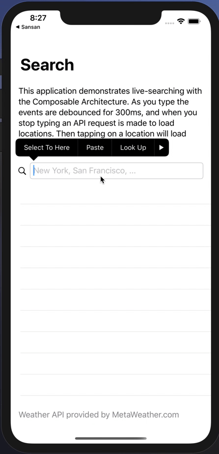
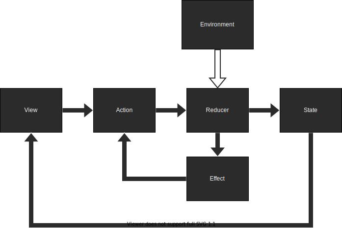
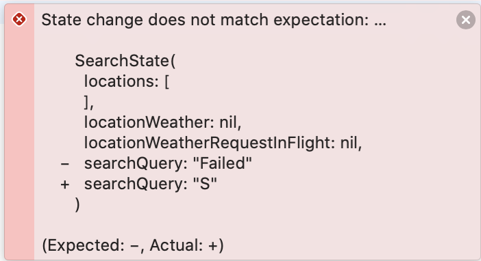

# Examples の Search プロジェクトから学ぶ TCA

---
# 自己紹介

- アイカワ（@kalupas0930）
- 新卒 iOS エンジニア
- 函館出身
- 最近は Flutter, 機械学習の勉強をしてます
- SwiftUI と Combine もまだまだ勉強中です

---
# 今回紹介する題材
- TCA の Exmaples の Search アプリ
  - 地名を入力する
  - 300ms 何も打たない
  - API Request が飛んで、該当する地名があれば表示される
  - 表示された地名をタップすると、その地域の天気情報が見れる
- Search アプリの Test
    - TCA の テストサポート機能
    - テストを書くのが楽・テスト結果もわかりやすい

---


---
# TCA の全体像



---
# ファイルツリー
- 全体のファイルツリー

```json
/Search
|--- /Search.xcodeproj
|--- /Search // 今回は主にここと
|--- /SearchTests // ここを紹介します
|--- README.md
```

---
# まずは Search 自体について
Search のファイルツリー

```json
/Search
|--- SearchView.swift // TCA の色々な要素* が詰め込まれています
|--- ActivityIndicator.swift // ただの ActivityIndicator
|--- SceneDelegate.swift // SearchView の初期化
|--- WeatherClient.swift // Model と API client の実装
|--- Info.plist
|--- Assets.xcassets
```

- TCA の色々な要素*
  - State, Action, Environment, Reducer, Effect, View

---
# Models

```swift
struct Location: Decodable, Equatable { // <- 今回は主にこちらだけ気にします
  var id: Int
  var title: String
}

struct LocationWeather: Decodable, Equatable {
  var consolidatedWeather: [ConsolidatedWeather]
  var id: Int

  struct ConsolidatedWeather: Decodable, Equatable {
    ...
  }
}
```

---
# API client interface

```swift
struct WeatherClient {
  var searchLocation: (String) -> Effect<[Location], Failure>
  var weather: (Int) -> Effect<LocationWeather, Failure>

  struct Failure: Error, Equatable {}
}
```

Effect はアプリケーションの副作用です。
TCA において副作用は Effect にのみ発生すべきとされています。

---
# API implementation / 全体像

```swift 
extension WeatherClient {
  static let live = WeatherClient(
    searchLocation: { query in
      ...
    },
    weather: { id in
      ...
    })
}
```

テスト用に利用することになる Mock API implementation も
ありますがそちらは後ほど紹介します

---
# API implementation / searchLocation

```swift
extension WeatherClient {
  static let live = WeatherClient(
    searchLocation: { query in
      var components = URLComponents(string: "https://www.metaweather.com/api/location/search")!
      components.queryItems = [URLQueryItem(name: "query", value: query)]

      return URLSession.shared.dataTaskPublisher(for: components.url!)
        .map { data, _ in data }
        .decode(type: [Location].self, decoder: jsonDecoder)
        .mapError { _ in Failure() }
        .eraseToEffect()
    },
    weather: { id in
      ...
    })
}
```

---
# API implementation / weather

```swift
extension WeatherClient {
  static let live = WeatherClient(
    searchLocation: { query in
      ...
    },
    weather: { id in
      let url = URL(string: "https://www.metaweather.com/api/location/\(id)")!

      return URLSession.shared.dataTaskPublisher(for: url)
        .map { data, _ in data }
        .decode(type: LocationWeather.self, decoder: jsonDecoder)
        .mapError { _ in Failure() }
        .eraseToEffect()
    })
}
```

---
# State, Action

```swift
struct SearchState: Equatable {
  var locations: [Location] = []
  var locationWeather: LocationWeather?
  var locationWeatherRequestInFlight: Location?
  var searchQuery = ""
}

enum SearchAction: Equatable {
  case locationsResponse(Result<[Location], WeatherClient.Failure>)
  case locationTapped(Location)
  case locationWeatherResponse(Result<LocationWeather, WeatherClient.Failure>)
  case searchQueryChanged(String)
}
```

---
# Environment

```swift
struct SearchEnvironment {
  var weatherClient: WeatherClient
  var mainQueue: AnySchedulerOf<DispatchQueue>
}
```
Environment で定義するのは以下のようなものです
- API Client, Scheduler などの依存関係
- 自分は、外部から注入するとテストが楽になるものを定義する
というイメージを持っています

---
# Reducer

```swift
let searchReducer = Reducer<SearchState, SearchAction, SearchEnvironment> {
  state, action, environment in
  switch action {
  case .locationsResponse(.failure):
  case let .locationsResponse(.success(response)):
  case let .locationTapped(location):
  case let .searchQueryChanged(query):
  case let .locationWeatherResponse(.failure(locationWeather)):
  case let .locationWeatherResponse(.success(locationWeather)):
  }
}
```

---
# View

```swift
struct SearchView: View {
  let store: Store<SearchState, SearchAction>

  var body: some View {
    WithViewStore(self.store) { viewStore in
      ...
    }
  }
```

View では `store` を定義して、`ViewStore` 経由でアクセスします

---
# 検索 TextField の動作（View, State）

- View
```swift
TextField("New York, San Francisco, ...",
          text: viewStore.binding(
          get: { $0.searchQuery }, send: SearchAction.searchQueryChanged)
)
```
- State
```swift
struct SearchState: Equatable {
  var searchQuery = ""
}
```
---
# 検索 TextField の動作（Reducer）

```swift
let searchReducer = Reducer<SearchState, SearchAction, SearchEnvironment> {
  state, action, environment in
  switch action {
  case .locationsResponse(.failure):
  case let .locationsResponse(.success(response)):
  case let .locationTapped(location):
  case let .searchQueryChanged(query): <------------- これが呼ばれる
  case let .locationWeatherResponse(.failure(locationWeather)):
  case let .locationWeatherResponse(.success(locationWeather)):
  }
}
```

---
# 検索 TextField の動作（Reducer）

```swift
case let .searchQueryChanged(query):
  struct SearchLocationId: Hashable {}
  state.searchQuery = query

  guard !query.isEmpty else {
    state.locations = []
    state.locationWeather = nil
    return .cancel(id: SearchLocationId())
  }

  return environment.weatherClient
    .searchLocation(query)
    .receive(on: environment.mainQueue)
    .catchToEffect()
    .debounce(id: SearchLocationId(), for: 0.3, scheduler: environment.mainQueue)
    .map(SearchAction.locationsResponse)
```

---
# 検索 TextField の動作（Reducer）

```swift
let searchReducer = Reducer<SearchState, SearchAction, SearchEnvironment> {
  state, action, environment in
  switch action {
  case .locationsResponse(.failure): <-------------------- 失敗すればこれ
  case let .locationsResponse(.success(response)): <------ 成功すればこれ
  case let .locationTapped(location):
  case let .searchQueryChanged(query):
  case let .locationWeatherResponse(.failure(locationWeather)):
  case let .locationWeatherResponse(.success(locationWeather)):
  }
}
```
---
# 検索 TextField の動作（Reducer）

- success
```swift
case let .locationsResponse(.success(response)):
    state.locations = response
    return .none
```

- failure
```swift
case .locationsResponse(.failure):
  state.locations = []
  return .none
```

---
# 次は SearchTests について

SearchTests に関係するファイルツリー

```json
/Search
|--- SearchView.swift // 先ほど紹介した各ロジックを使用します
|--- WeatherClient.swift // mock の API Client が定義されています
/SearchTests
|--- SearchTests.swift // テスト本体です
```

---
# SearchTests 内で使用する変数

```swift
private let mockLocations = [
  Location(id: 1, title: "Brooklyn"),
  Location(id: 2, title: "Los Angeles"),
  Location(id: 3, title: "San Francisco"),
]
```

---
# SearchTests 内で使用する Mock Client

```swift
extension WeatherClient {
  static func mock(
    searchLocation: @escaping (String) -> Effect<[Location], Failure> = { _ in
      fatalError("Unmocked")
    },
    weather: @escaping (Int) -> Effect<LocationWeather, Failure> = { _ in fatalError("Unmocked") }
  ) -> Self {
    Self(
      searchLocation: searchLocation,
      weather: weather
    )
  }
}
```

---
# SearchTests の全体感

```swift
import Combine
import ComposableArchitecture
import XCTest

@testable import Search

class SearchTests: XCTestCase {
  // テスト用スケジューラー
  let scheduler = DispatchQueue.testScheduler

  func testSearchAndClearQuery() { ... }
  func testSearchFailure() { ... }
  func test...() { ... }
```

---
## 今回紹介するテスト

- `func testSearchAndClearQuery() { ... }`
  - 検索が成功し、その後に検索クエリを消した時の動作のテスト
- `func testSearchFailure() {...}`
  - 検索が失敗した時の動作のテスト

---
## 検索成功・その後にクエリを消す動作のテスト

```swift
func testSearchAndClearQuery() {
    let store = TestStore(
      initialState: .init(),
      reducer: searchReducer,
      environment: SearchEnvironment(
        weatherClient: .mock(),
        mainQueue: self.scheduler.eraseToAnyScheduler()
      )
    )

    store.assert(
      ...
    )
  }
```

---
## 検索成功・その後にクエリを消す動作のテスト

```swift
store.assert(
  .environment { // mock client に 成功時の searchLocation を注入
    $0.weatherClient.searchLocation = { _ in Effect(value: mockLocations) }
  },
  .send(.searchQueryChanged("S")) { // "S" で検索する Action を実行
    $0.searchQuery = "S"
  },
  .do { self.scheduler.advance(by: 0.3) }, // 300ms 時間を進める
  .receive(.locationsResponse(.success(mockLocations))) { // 成功であることを確認
    $0.locations = mockLocations // state の locations が 結果と等しいことを確認
  },
  .send(.searchQueryChanged("")) { // 検索クエリを空にする Action を実行
    $0.locations = [] // state の locations は空になり
    $0.searchQuery = ""　// state の searchQuery も空になっていることを確認
  }
)
```

---
## 先ほどのテストをわざと失敗させてみます

```swift
store.assert(
  .environment {
    $0.weatherClient.searchLocation = { _ in Effect(value: mockLocations) }
  },
  .send(.searchQueryChanged("S")) {
    $0.searchQuery = "Failed" // わざと違う文字（Failed）で失敗させる！
  },
  .do { self.scheduler.advance(by: 0.3) },
  .receive(.locationsResponse(.success(mockLocations))) {
    $0.locations = mockLocations
  },
  .send(.searchQueryChanged("")) {
    $0.locations = []
    $0.searchQuery = ""
  }
)
```

---
## こんな感じでわかりやすく表示してくれます



---
## 検索が失敗した時の動作のテスト

```swift
func testSearchFailure() {
    let store = TestStore(
      initialState: .init(),
      reducer: searchReducer,
      environment: SearchEnvironment(
        weatherClient: .mock(),
        mainQueue: self.scheduler.eraseToAnyScheduler()
      )
    )

    store.assert(
      ...
    )
  }
```

---
## 検索が失敗した時の動作のテスト

```swift
store.assert(
  .environment { // mock client に 失敗時の searchLocation を注入
    $0.weatherClient.searchLocation = { _ in Effect(error: .init()) }
  },
  .send(.searchQueryChanged("S")) { // "S" で検索した時の Action を実行
    $0.searchQuery = "S" // state の searchQuery が "S" であることを確認
  },
  .do { self.scheduler.advance(by: 0.3) }, // 300ms 進める
  .receive(.locationsResponse(.failure(.init()))) // エラー時の Action であることを確認
)
```

---
## おわりに

- 何となく雰囲気を掴んで頂けていれば幸いです
- 基本的な流れが掴めたら、きっとあとは慣れるだけです
  - まだ自分も慣れるほどコードを書いていないですが 😢
- 今回紹介した以外にも色々できます
  - 複数の Reducer を組み合わせて、複雑な状態を簡潔に表現できる
  - UIKit でも使える