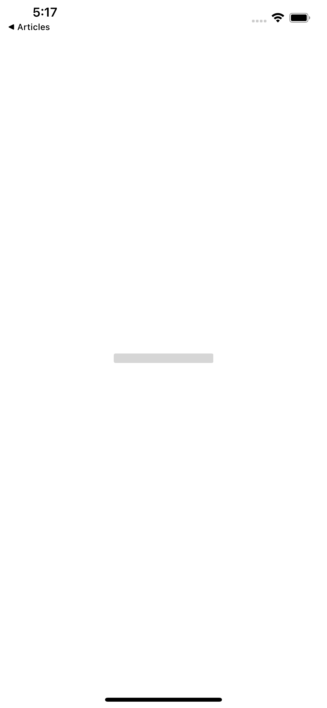
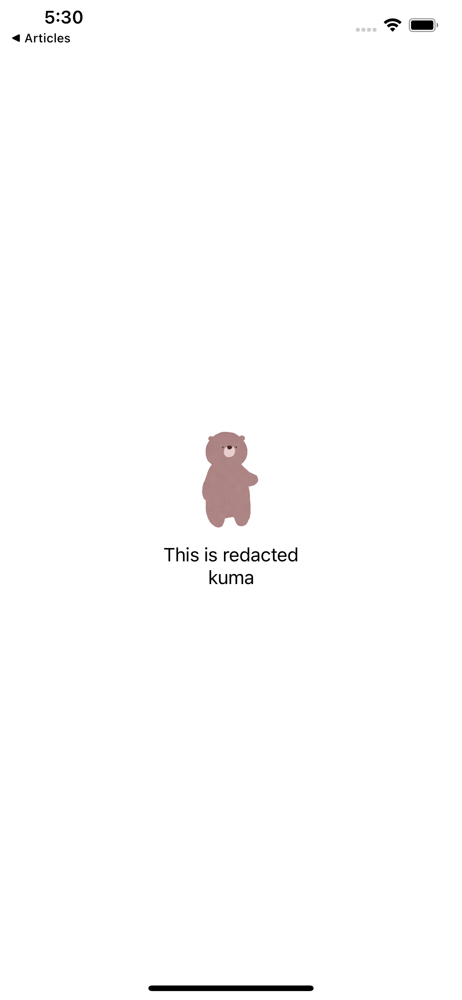
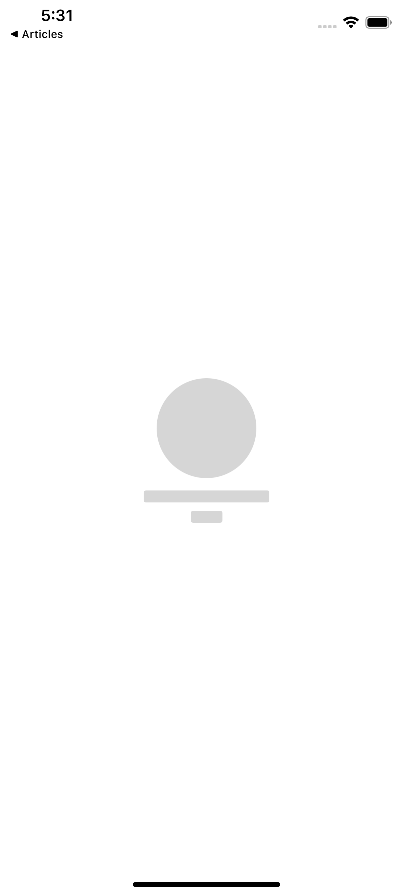
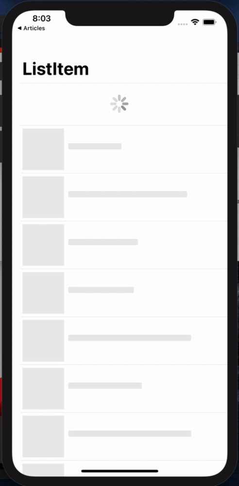

<!--
_class: lead
_footer: iOSアプリ開発のためのFunctional Architecture情報共有会
_paginate: false
-->
# redacted を TCA でスマートに扱う

---
## redacted とは？

- SkeltetonView のようなもの
- SwiftUI で iOS14 から使用できる ViewModifier
- とても便利

---


---
## SwiftUI でどう使う？

```swift
Text("This is redacted")
    .redacted(reason: .placeholder)
```



---
## ViewModifier ならではの使い方

```swift
VStack {
    Image("kuma")
        .resizable()
        .frame(width: 100, height: 100)
        .clipShape(Circle())
    
    Text("This is redacted")
    
    Text("kuma")
}

```



---
## ViewModifier ならではの使い方

- ViewModifier なので簡単に Skeleton を
表現できる

```swift
VStack {
    Image("kuma")
        .resizable()
        .frame(width: 100, height: 100)
        .clipShape(Circle())
    
    Text("This is redacted")
    
    Text("kuma")
}
.redacted(reason: .placeholder)

```



---
## もう少しだけ redacted について深掘り

- redacted は以下のように定義されている
`func redacted(reason: RedactionReasons) -> some View`

- RedactionReasons は？
    - 現時点では先ほど紹介した `placeholder` しか持っていない
    - `OptionSet` に適合しているため、将来的には他の `reason` も
    使えるようになるかもしれない
    - ちなみに現時点でもオリジナルの `ReactionReasons` を作って、
    `reason` を使い分けることはできる

---
## 状態管理含めた時の redacted を見ていきます

- まずは `@ObservableObejct` を利用した TCA を利用しない 
SwiftUI での使用方法を見ていく

- 単純なリスト表示をするだけのアプリを作る

---


---
## 扱う状態

```swift
struct Item: Equatable, Identifiable {
    let id: UUID
    let title: String
    let description: String
}

```

基本的な title と description を持っているだけ

---
## プレースホルダー用の変数

```swift
let placeholderListItem = (0...10).map { _ in
    Item(
        id: .init(),
        title: String(repeating: " ", count: .random(in: 50...100)),
        description: String(repeating: " ", count: .random(in: 10...30))
    )
}
```

title と description は適当にスペースで埋めてそれっぽくしている

---
## ロード完了後用の変数

```swift
let liveListItem = [
    Item(id: .init(), title: "これは redacted",
         description: String(repeating: "おはよう", count: 10)),
    Item(id: .init(), title: "This is redacted", 
         description: String(repeating: "Good morning", count: 10)),
    Item(id: .init(), title: "よろしくお願いします", 
         description: String(repeating: "yes,yes", count: 10))
]

```

中身は適当です

---
## 状態管理用の ObservableObject

```swift
class ListItemViewModel: ObservableObject {
    @Published var listItem: [Item] = []
    @Published var isLoading = false
    
    init() {
        isLoading = true
        // 4s 経ったら自動的に動作するようにする
        DispatchQueue.main.asyncAfter(deadline: .now() + 4){
            self.isLoading = false
            self.listItem = liveListItem
        }
    }
}
```

---
## View を少しずつ見ていきます

```swift
@ObservedObject private var viewModel = ListItemViewModel()
var body: some View {
    List {
        if viewModel.isLoading {
            ActivityIndicator().frame(maxWidth: .infinity).padding()
        }
        ForEach(
            ... // 繰り返す Item
            Button(action: {
                ... // ボタンを押した時のアクション
            }) {
                ... // ボタンの View
            }
        }
}
```

---
## ForEach の中身 / ボタンのアクション

```swift
@ObservedObject private var viewModel = ListItemViewModel()
    ... // 省略
    ForEach(
        viewModel.isLoading
            ? placeholderListItem
            : viewModel.listItem) { item in
        Button(action: {
            guard !self.viewModel.isLoading else { return }
            print("Button was tapped")
        }) {
            ... // ボタンの View
        }
    }
```

---
## ForEach の中身 / ボタンの View

```swift
@ObservedObject private var viewModel = ListItemViewModel()
    ... // 省略
    ForEach( ... ) { item in
        Button(action: { ... }) {
            HStack(alignment: .top) {
                Image("kuma")
                    .resizable()
                    .frame(width: 80, height: 80)
                VStack(alignment: .leading, spacing: 10) {
                    Text(item.title).font(.title2)
                    Text(item.description).font(.body)
                }
            }
        }
    }
```

---
## redacted を追加

```swift
@ObservedObject private var viewModel = ListItemViewModel()
var body: some View {
    List {
        if viewModel.isLoading {
            ActivityIndicator().frame(maxWidth: .infinity).padding()
        }
        ForEach(
            ... // 繰り返す Item
            Button(action: {
                ... // ボタンを押した時のアクション
            }) {
                ... // ボタンの View
            }
            .redacted(reason: viewModel.isLoading ? .placeholder: [])
        }
}
```

---
## disabled も追加

```swift
@ObservedObject private var viewModel = ListItemViewModel()
var body: some View {
    List {
        if viewModel.isLoading {
            ActivityIndicator().frame(maxWidth: .infinity).padding()
        }
        ForEach(
            ... // 繰り返す Item
            Button(action: {
                ... // ボタンを押した時のアクション
            }) {
                ... // ボタンの View
            }
            .redacted(reason: viewModel.isLoading ? .placeholder: [])
            .disabled(viewModel.isLoading) // これを追加
        }
}
```

---
## やりたいことは実現できた

しかし、この方法には問題点がある

- View のあちこちで `viewModel.isLoading` を使っている
    - 状態が増えてきた時に開発者が気にしなければならないことが
    多くなってしまう
- `disabled` によってロード中はタップできないようにできたが、
`disabled` の利用シーンとしては微妙
    - もし `onAppear` などがあった際、それを防ぐことはできない
    - 色が少し明るくなってしまうので、本来意図している View の色とは異なるものになるかもしれない

---
## The Composable Architecture なら？
- 基本的な TCA の流れ
    - View から Action を送る
    - Action によって Reducer で Store の State が変更される
- イメージは `isLoading` によって Store を使い分ける
    - `isLoading` が
        - `true`(ロード中) : プレースホルダー用の Store
        - `false`(ロード完了): 本物の Store

---
## 実際に TCA を使った例を紹介します

まずは State

```swift
struct ListItemState: Equatable {
  var listItem: [Item] = []
  var isLoading = false
}
```

- 先ほどの `@ObservableObject` を利用した class と大きな差はない
- State は Action を通じてのみ変更されるため、struct 内に
状態を変化させるための関数はない

---
## Action

```swift
enum ListItemAction {
    case listItemResponse([Item]?)
    case onAppear
}
```

- View の `onAppear` 時に呼ばれる Action
- その Action によって発火する `listItemResponse([Item]?)`

---
## Reducer

```swift
let listItemReducer = Reducer<ListItemState, ListItemAction, Void> { state, action, environment in
    switch action {
    case let .listItemResponse(listItem):
        state.isLoading = false
        state.listItem = listItem ?? []
        return .none
    case .onAppear:
        state.isLoading = true
        return Effect(value: .listItemResponse(liveListItem))
            .delay(for: 4, scheduler: DispatchQueue.main)
            .eraseToEffect()
    }
}
```

`onAppear` してから、わざと 4s 遅らせるようにして API 通信してる風にしているだけ

---
## View の全体像

```swift
let store: Store<ListItemState, ListItemAction>
    
    var body: some View {
        WithViewStore(store) { viewStore in
            List {
                if viewStore.isLoading {
                    ActivityIndicator().padding().frame(maxWidth: .infinity)
                }
                ListItemView(
                    // (プレースホルダー store) or (本物 store) を渡す
                )
                .redacted(reason: viewStore.isLoading ? .placeholder : [])
            }
            .onAppear { viewStore.send(.onAppear) }
        }
    }
```

---
## 一応 ListItemView の中身

```swift
let store: Store<ListItemState, ListItemAction>

    var body: some View {
        WithViewStore(store) { viewStore in
            ForEach(viewStore.listItem) { item in // 本当は ForEachStore などを使うと良い
                Button(action: {
                    // ここで viewStore.send() としても、placeholder store であれば
                    // state に影響はないので、send し放題
                }) {
                    HStack(alignment: .top) {
                        Image("kuma").resizable().frame(width: 80, height: 80)
                        VStack(alignment: .leading, spacing: 10) {
                            Text(item.title).font(.title2)
                            Text(item.description).font(.body)
                        }
                    }
                }
                .buttonStyle(PlainButtonStyle())
            }
        }
    }
```

---
## TCA と redacted を組み合わせれば

- 開発者は最初に `isLoading` の状態によって、Store を使い分ける
という判断だけで良くなる

- `disabled` を使用せずとも、「ローディング中のセルをタップ
しても何も起きないようにする」という動作を実現できた

- 今回は扱う State を説明のために絞ったが、State が多くなれば
なるほど TCA の恩恵を受けることができる